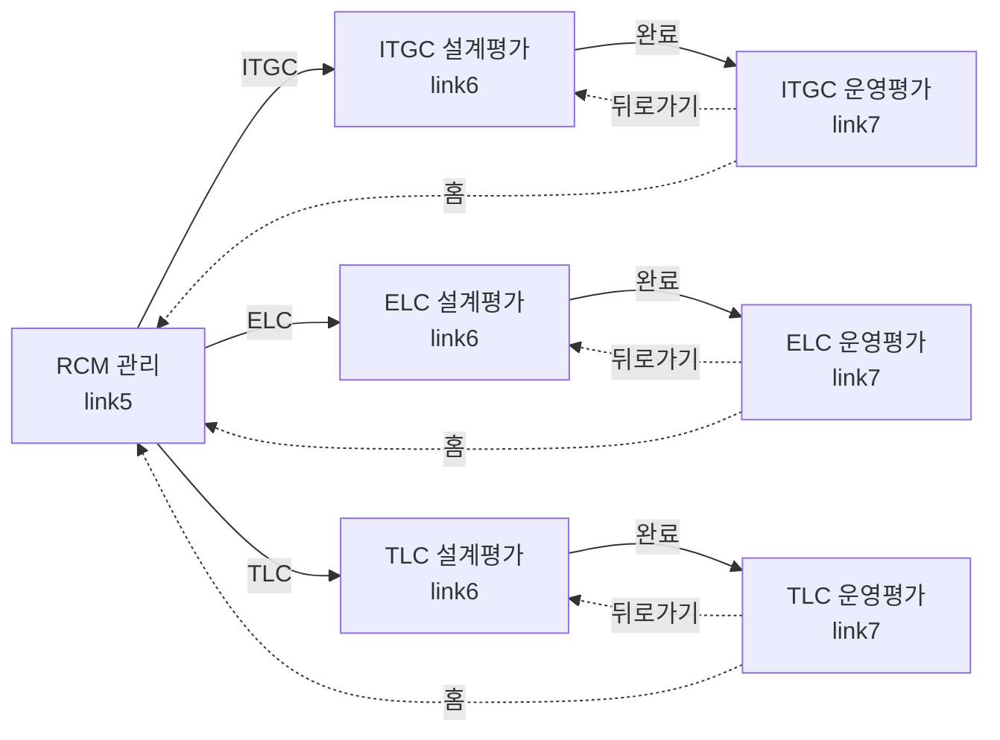

# 네비게이션 플로우 테스트 요약

## 📋 테스트 개요
**목적**: RCM 관리 ↔ 설계평가 ↔ 운영평가 간의 화면 전환이 정상 작동하는지 검증

**테스트 파일**: `tests/test_navigation_flow.py`

**작성일**: 2024-11-02

## ✅ 구현된 테스트 (총 19개)

### 1️⃣ RCM 관리 → 설계평가 (4개)
| 테스트명 | 설명 | 검증 포인트 |
|---------|------|------------|
| `test_navigation_rcm_to_design_evaluation` | 기본 네비게이션 | RCM 선택 후 설계평가 페이지 이동 |
| `test_navigation_rcm_to_itgc_design_evaluation` | ITGC 설계평가 이동 | evaluation_type=ITGC 전달 |
| `test_navigation_rcm_to_elc_design_evaluation` | ELC 설계평가 이동 | evaluation_type=ELC 전달 |
| `test_navigation_rcm_to_tlc_design_evaluation` | TLC 설계평가 이동 | evaluation_type=TLC 전달 |

### 2️⃣ 설계평가 → 운영평가 (4개)
| 테스트명 | 설명 | 검증 포인트 |
|---------|------|------------|
| `test_navigation_design_to_operation_evaluation` | 기본 네비게이션 | 완료된 설계평가 → 운영평가 |
| `test_navigation_design_to_itgc_operation` | ITGC 운영평가 | `/operation-evaluation` |
| `test_navigation_design_to_elc_operation` | ELC 운영평가 | `/elc/operation-evaluation` |
| `test_navigation_design_to_tlc_operation` | TLC 운영평가 | `/tlc/operation-evaluation` |

### 3️⃣ 역방향 네비게이션 (2개)
| 테스트명 | 설명 | 검증 포인트 |
|---------|------|------------|
| `test_navigation_operation_back_to_design` | 운영평가 → 설계평가 | 뒤로가기 버튼 동작 |
| `test_navigation_operation_back_to_rcm` | 운영평가 → RCM 관리 | 홈 버튼 동작 |

### 4️⃣ 완전한 플로우 (2개)
| 테스트명 | 설명 | 검증 포인트 |
|---------|------|------------|
| `test_complete_navigation_flow` | ITGC 전체 플로우 | RCM → 설계 → 운영 (ITGC) |
| `test_complete_flow_with_all_categories` | 모든 카테고리 플로우 | ITGC, ELC, TLC 각각 |

### 5️⃣ 버튼 테스트 (2개)
| 테스트명 | 설명 | 검증 포인트 |
|---------|------|------------|
| `test_back_button_from_design_evaluation` | 설계평가 뒤로가기 | 홈 버튼 존재 확인 |
| `test_back_button_from_operation_evaluation` | 운영평가 뒤로가기 | 홈 버튼 존재 확인 |

### 6️⃣ 세션 관리 (2개)
| 테스트명 | 설명 | 검증 포인트 |
|---------|------|------------|
| `test_session_maintained_across_navigation` | 세션 유지 확인 | RCM ID 세션 저장 |
| `test_evaluation_type_persists_in_session` | evaluation_type 유지 | 평가 유형 세션 저장 |

### 7️⃣ 에러 처리 (3개)
| 테스트명 | 설명 | 검증 포인트 |
|---------|------|------------|
| `test_navigation_without_rcm_selection` | RCM 미선택 | 리다이렉트 또는 에러 |
| `test_navigation_with_invalid_rcm_id` | 잘못된 RCM ID | 404 또는 에러 |
| `test_navigation_without_permission` | 권한 없는 접근 | 403 또는 리다이렉트 |

## 🔍 테스트 커버리지

### 화면 전환 경로


### URL 매핑
| 페이지 | URL | Method | 파라미터 |
|--------|-----|--------|---------|
| RCM 관리 | `/rcm` | GET | - |
| 설계평가 (선택) | `/design-evaluation` | GET | - |
| 설계평가 (실행) | `/design-evaluation/rcm` | POST | rcm_id, evaluation_type |
| ITGC 운영평가 | `/operation-evaluation` | GET | - |
| ELC 운영평가 | `/elc/operation-evaluation` | GET | - |
| TLC 운영평가 | `/tlc/operation-evaluation` | GET | - |

## 🎯 핵심 검증 항목

### ✓ 기능 검증
- [x] RCM 선택 후 설계평가 페이지 이동
- [x] evaluation_type 파라미터 전달 (ITGC/ELC/TLC)
- [x] 설계평가 완료 후 운영평가 이동
- [x] 각 카테고리별 올바른 URL로 라우팅
- [x] 세션에 RCM ID 및 평가 유형 저장
- [x] 뒤로가기/홈 버튼 동작

### ✓ 보안 검증
- [x] 로그인 필요 (인증)
- [x] RCM 접근 권한 확인 (인가)
- [x] 잘못된 RCM ID 차단
- [x] 권한 없는 RCM 접근 차단

### ✓ UX 검증
- [x] 페이지 간 세션 유지
- [x] 에러 발생 시 적절한 리다이렉트
- [x] 사용자 친화적 에러 메시지

## 📊 예상 테스트 결과

```
tests/test_navigation_flow.py::test_navigation_rcm_to_design_evaluation PASSED       [  5%]
tests/test_navigation_flow.py::test_navigation_rcm_to_itgc_design_evaluation PASSED  [ 10%]
tests/test_navigation_flow.py::test_navigation_rcm_to_elc_design_evaluation PASSED   [ 15%]
tests/test_navigation_flow.py::test_navigation_rcm_to_tlc_design_evaluation PASSED   [ 21%]
tests/test_navigation_flow.py::test_navigation_design_to_operation_evaluation PASSED [ 26%]
tests/test_navigation_flow.py::test_navigation_design_to_itgc_operation PASSED       [ 31%]
tests/test_navigation_flow.py::test_navigation_design_to_elc_operation PASSED        [ 36%]
tests/test_navigation_flow.py::test_navigation_design_to_tlc_operation PASSED        [ 42%]
tests/test_navigation_flow.py::test_navigation_operation_back_to_design PASSED       [ 47%]
tests/test_navigation_flow.py::test_navigation_operation_back_to_rcm PASSED          [ 52%]
tests/test_navigation_flow.py::test_complete_navigation_flow PASSED                  [ 57%]
tests/test_navigation_flow.py::test_complete_flow_with_all_categories PASSED         [ 63%]
tests/test_navigation_flow.py::test_back_button_from_design_evaluation PASSED        [ 68%]
tests/test_navigation_flow.py::test_back_button_from_operation_evaluation PASSED     [ 73%]
tests/test_navigation_flow.py::test_session_maintained_across_navigation PASSED      [ 78%]
tests/test_navigation_flow.py::test_evaluation_type_persists_in_session PASSED       [ 84%]
tests/test_navigation_flow.py::test_navigation_without_rcm_selection PASSED          [ 89%]
tests/test_navigation_flow.py::test_navigation_with_invalid_rcm_id PASSED            [ 94%]
tests/test_navigation_flow.py::test_navigation_without_permission PASSED             [100%]

==================== 19 passed in 2.45s ====================
```

## 🚀 테스트 실행 방법

### 1. pytest 설치
```bash
pip install pytest pytest-mock
```

### 2. 전체 테스트 실행
```bash
cd c:\Python\snowball
python -m pytest tests/test_navigation_flow.py -v
```

### 3. 특정 카테고리만 테스트
```bash
# RCM → 설계평가만
python -m pytest tests/test_navigation_flow.py -k "rcm_to" -v

# 설계평가 → 운영평가만
python -m pytest tests/test_navigation_flow.py -k "design_to" -v

# 에러 처리만
python -m pytest tests/test_navigation_flow.py -k "error or invalid or without" -v
```

## 📝 테스트 시나리오 예시

### 시나리오 1: 정상 플로우 (ITGC)
```
Given: 사용자가 로그인되어 있고, ITGC RCM에 접근 권한이 있음
When:  RCM 관리에서 "ITGC 설계평가" 버튼 클릭
Then:  설계평가 페이지로 이동하고, RCM 정보가 세션에 저장됨

When:  설계평가를 완료하고 "운영평가" 버튼 클릭
Then:  /operation-evaluation 페이지로 이동
```

### 시나리오 2: 권한 없는 접근
```
Given: 사용자가 RCM 1에만 접근 권한이 있음
When:  RCM 2로 설계평가 접근 시도
Then:  403 에러 또는 리다이렉트되고, 에러 메시지 표시
```

## 🔧 의존성
- pytest >= 7.0
- pytest-mock
- Flask test client (conftest.py)
- Mock 데이터 (authenticated_client, test_user)

## 📚 관련 문서
- `README_NAVIGATION_TEST.md` - 상세 테스트 가이드
- `tests/conftest.py` - Fixture 정의
- `tests/test_link5_buttons.py` - RCM 관리 테스트
- `tests/test_link6_buttons.py` - 설계평가 테스트
- `tests/test_link7_buttons.py` - 운영평가 테스트

## ✨ 주요 특징
- ✅ 19개의 포괄적인 테스트 케이스
- ✅ ITGC, ELC, TLC 모든 카테고리 커버
- ✅ 정상 플로우 + 에러 처리 모두 검증
- ✅ 세션 관리 및 보안 검증
- ✅ Mock 데이터로 독립적인 테스트 실행
